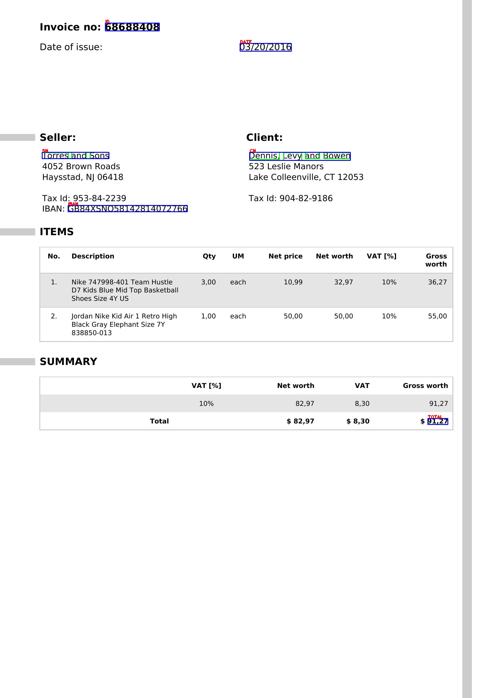
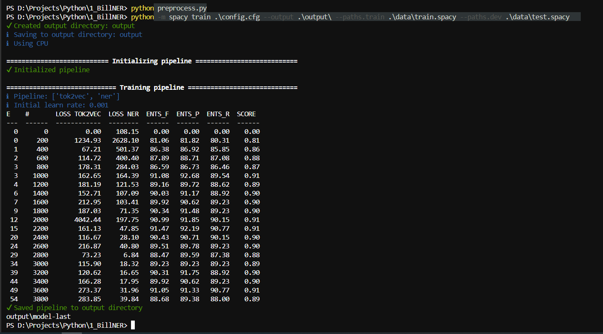

# Bill-Wise V2.0


An AI-powered Named Entity Recognition (NER) system that automatically extracts key information from invoice or bill images using OCR and a custom-trained spaCy model.

---

## Overview

Bill-Wise V2.0 processes invoice/bill images and identifies structured fields such as invoice IDs, dates, seller names, client names, IBANs, and totals — turning unstructured scanned documents into structured data.

The pipeline goes from raw invoice images → OCR text extraction → manual BIO labeling → spaCy model training → entity extraction.

---

## Prediction Example

The model takes an invoice image, extracts text via OCR, and highlights the named entities directly on the document:



---

## Resources & Tools Used

- **Invoice Dataset** — [High Quality Invoice Images for OCR](https://www.kaggle.com/datasets/osamahosamabdellatif/high-quality-invoice-images-for-ocr) (Kaggle)
- **Tesseract OCR** — [tesseract-ocr-w64-setup-v4.1.0.20190314.exe](https://digi.bib.uni-mannheim.de/tesseract/) (Uni Mannheim builds)
- **spaCy** — [spacy.io](https://spacy.io/) — NER model training framework

---

## Entity Labels Using BIO Labeling

| Label | Description | Example |
|-------|-------------|---------|
| `ID` | Invoice number | `51109338` |
| `DATE` | Date of issue | `04/13/2013` |
| `SN` | Seller name | `Andrews, Kirby and Valdez` |
| `CN` | Client name | `Becker Ltd` |
| `IBAN` | Seller bank IBAN | `GB75MCRL06841367619257` |
| `TOTAL` | Grand total amount | `$6,204.19` |

---

## Project Structure

```
1_BillNER/
├── batch_1/                  # Raw invoice image batch 1
├── batch_2/                  # Raw invoice image batch 2
├── batch_3/                  # Raw invoice image batch 3
├── data/
│   ├── TrainData.pickle      # Annotated training data (images 001-265)
│   ├── TestData.pickle       # Annotated testing data (images 266-300)
│   ├── train.spacy           # spaCy binary training corpus
│   ├── test.spacy            # spaCy binary test corpus
│   └── output/               # Intermediate outputs
├── output/
│   ├── model-best/           # Best checkpoint during training
│   └── model-last/           # Final trained spaCy NER model
├── Selected/                 # 300 selected and renamed invoice images
├── all_inovices.csv          # OCR-extracted tokens with BIO tags
├── all_inovices.txt          # Text version of extracted data
├── organizing.py             # Selects and organizes invoice images
├── preprocess.py             # Converts pickle annotations to .spacy format
├── Preparation.ipynb         # BIO annotation and labeling notebook
├── Preparation2.ipynb        # OCR extraction with Tesseract
├── Data_Preprocessing.ipynb  # Train/test split and final preprocessing
├── predictions.ipynb         # Inference and bounding box visualization
├── base_config.cfg           # spaCy base configuration
└── config.cfg                # Full spaCy training configuration
```

---

## Pipeline

```
Invoice Images (JPEG)
       |
       v
[ Preparation2.ipynb ]         -- Import libraries, load images, run Tesseract OCR
       |                          Clean extracted text, save tokens to CSV
       v
  all_inovices.csv  (id, text)
       |
       v
[ Manual BIO Labeling ]        -- Tag each token with B-/I- prefix for each entity
       |                          Done manually for all 300 invoices (~half a day of work)
       v
  all_inovices.csv  (id, text, tag)
       |
       v
[ Preparation.ipynb ]          -- Load spaCy NER model, extract text from images
       |                          Get named entities, convert dataframe to content,
       |                          join labels to token dataframes, apply bounding boxes,
       |                          combine BIO information, tag each word
       v
TrainData.pickle / TestData.pickle
       |
       v
[ preprocess.py ]              -- Convert annotations to spaCy DocBin format
       |
       v
train.spacy / test.spacy
       |
       v
[ spacy train ]                -- Train tok2vec + NER pipeline
       |
       v
  output/model-best  /  output/model-last
       |
       v
[ predictions.ipynb ]          -- Load model, run inference, draw bounding boxes
```

---

## Getting Started

### 1. Clone the repository

```bash
git clone https://github.com/Younes-Barkat/Bill-Wise-V2.0.git
cd Bill-Wise-V2.0
```

### 2. Install Tesseract OCR

Download and install **[tesseract-ocr-w64-setup-v4.1.0.20190314.exe](https://digi.bib.uni-mannheim.de/tesseract/)** and make sure it is added to your system PATH.

### 3. Create a virtual environment and install dependencies

```bash
python -m venv venv
venv\Scripts\activate
pip install -r requirements.txt
```

### 4. Organize invoice images

```bash
python organizing.py
```

Selects up to 300 invoice images from the batch folders and copies them into `Selected/` with standardized filenames (`001.jpeg`, `002.jpeg`, ...).

### 5. Run OCR extraction

Open and run **`Preparation2.ipynb`** — this uses Tesseract to extract tokens from each invoice image and saves the results to `all_inovices.csv`.

### 6. Manual BIO Labeling

Each token in `all_inovices.csv` was labeled manually using the BIO (Beginning / Inside / Outside) tagging scheme for all 300 invoice images. This was the most time-intensive step, taking approximately half a day to complete.

| Tag | Meaning |
|-----|---------|
| `B-<LABEL>` | Beginning of an entity |
| `I-<LABEL>` | Inside (continuation) of an entity |
| `O` | Outside — not an entity |

### 7. Prepare training data

Open and run **`Preparation.ipynb`** and **`Data_Preprocessing.ipynb`** to load the labeled data, join labels to token dataframes, apply bounding box coordinates, combine the BIO information, and generate `TrainData.pickle` (images 1-265) and `TestData.pickle` (images 266-300).

### 8. Convert to spaCy format

```bash
python preprocess.py
```

Generates `data/train.spacy` and `data/test.spacy`.

### 9. Initialize and train the model

```bash
python -m spacy init fill-config ./base_config.cfg ./config.cfg

python -m spacy train ./config.cfg --output ./output/ --paths.train ./data/train.spacy --paths.dev ./data/test.spacy
```

### 10. Run predictions

Open **`predictions.ipynb`** to load the trained model, run inference on new invoice images, and visualize the extracted entities with bounding boxes drawn directly on the document.

---

## Training Results

The model was trained on **265 annotated invoice images** and evaluated on **35 held-out images** (images 266-300), using spaCy's `tok2vec` + `ner` pipeline on CPU.

| Metric | Score |
|--------|-------|
| F1-Score (ENTS_F) | ~91% |
| Precision (ENTS_P) | ~91% |
| Recall (ENTS_R) | ~91% |
| Best overall score | 0.91 |

Training converged around 3,000-3,800 steps with `patience = 1600` and `max_steps = 20000`.



---

## Model Architecture

- **Framework:** spaCy 3.8
- **Pipeline:** `tok2vec` -> `ner`
- **Embeddings:** `MultiHashEmbed` on NORM, PREFIX, SUFFIX, SHAPE features
- **Encoder:** `MaxoutWindowEncoder` (width=96, depth=4, window_size=1)
- **NER decoder:** `TransitionBasedParser` (hidden_width=64)
- **Optimizer:** Adam (lr=0.001, L2=0.01, dropout=0.1)

---

## Requirements

Key dependencies (see `requirements.txt` for the full list):

- Python 3.11
- spaCy 3.8
- pytesseract 0.3.13
- opencv-python 4.x
- pandas 3.x
- numpy 2.x
- tqdm, natsort

---

## Author

**Younes Barkat** — [GitHub](https://github.com/Younes-Barkat)
